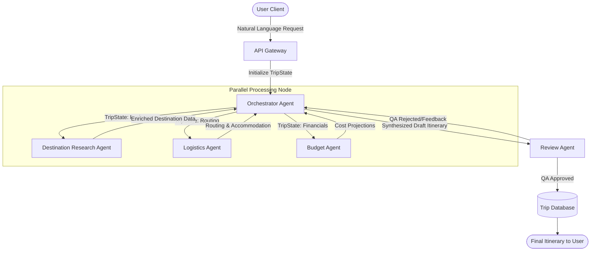
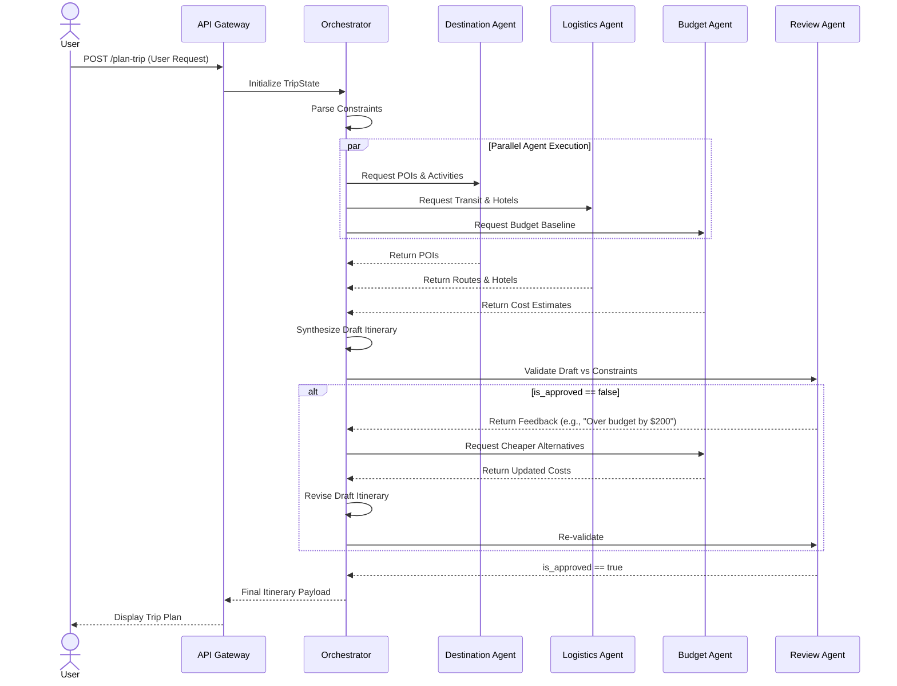

# Multi-Agent Travel Planner Architecture

## 1. Executive Summary
The **AI Travel Planner** is an intelligent, multi-agent orchestrator designed to transform natural-language travel requests into actionable, personalized, and budget-conscious itineraries. By employing a distributed agent topology (Orchestrator, Destination, Logistics, Budget, and Review), the system ensures comprehensive coverage of user constraints while minimizing hallucination and logical inconsistencies.

## 2. System Architecture & Topology

The architecture leverages a **Directed Acyclic Graph (DAG) with Feedback Loops** pattern, well-suited for state-machine-driven agent frameworks like LangGraph or AutoGen. 

### 2.1. High-Level Flow


## 3. Agent Roles & Specifications

### 3.1. Orchestrator Agent (The Manager)
* **Core Responsibility**: Acts as the central nervous system. It parses user intent, manages the global state (`TripState`), coordinates parallel sub-tasks, and synthesizes the final outputs.
* **Input**: Raw user prompts (e.g., "5-day trip to Japan, $3k budget...").
* **Output**: Delegated task assignments, Draft Itinerary.
* **Key Tasks**:
  * Intent extraction and entity recognition.
  * State management and conflict resolution between worker outputs.

### 3.2. Destination Research Agent (The Guide)
* **Core Responsibility**: Curates the 'what' and 'where' based on user preferences and avoidances.
* **Integrations**: Search APIs (Tavily/Google), Wikipedia, Yelp/TripAdvisor.
* **Key Tasks**:
  * Identify points of interest (POIs) matching constraints (e.g., temples, food).
  * Filter out avoidances (e.g., overcrowded areas).
  * Categorize items into "Must-Do" vs "Nice-to-Have".

### 3.3. Logistics Agent (The Planner)
* **Core Responsibility**: Manages the 'how' and 'when'. Focuses on spatiotemporal realism.
* **Integrations**: Google Maps API (Routing Matrix), Transit APIs (Hyperdia/Jorudan equivalents), Hotel APIs.
* **Key Tasks**:
  * Sequence daily activities to minimize transit time.
  * Suggest optimal neighborhoods for accommodation based on the itinerary.
  * Provide inter-city and intra-city transit options (e.g., Shinkansen schedules).

### 3.4. Budget Agent (The Accountant)
* **Core Responsibility**: Monitors financial constraints and optimizes value.
* **Integrations**: Currency Exchange APIs, Historical Pricing Databases.
* **Key Tasks**:
  * Apportion the total budget across categories (Accommodation, Transport, Food, Activities).
  * Audit projected costs from the Destination and Logistics agents.
  * Suggest cost-saving alternatives if the initial draft exceeds constraints.

### 3.5. Review Agent (The QA Auditor)
* **Core Responsibility**: Independent validation of the synthesized itinerary against the original user constraints.
* **LLM Strategy**: Must utilize a different underlying LLM (e.g., Claude 3.5 Sonnet if Orchestrator is GPT-4o) to mitigate systemic bias and "groupthink."
* **Key Tasks**:
  * Verify constraint satisfaction (duration, budget, specific inclusions/exclusions).
  * Assess logical feasibility (e.g., ensuring enough time is allocated for travel between POIs).
  * Output a boolean `is_approved` flag and a `feedback_rationale` array.

## 4. Data Models & State Management

The system relies on a shared, strongly-typed state object (`TripState`) passed through the graph.

```json
{
  "trip_id": "uuid-1234",
  "original_prompt": "Plan a 5-day trip to Japan...",
  "constraints": {
    "duration_days": 5,
    "budget_usd": 3000,
    "destinations": ["Tokyo", "Kyoto"],
    "preferences": ["food", "temples"],
    "avoidances": ["crowds"]
  },
  "agent_outputs": {
    "destination_data": {},
    "logistics_data": {},
    "budget_data": {}
  },
  "draft_itinerary": {},
  "review_status": {
    "is_approved": false,
    "feedback": []
  }
}
```

## 5. Sequence Diagram



## 6. Technology Stack & Deployment

| Layer | Recommended Technology | Justification |
| :--- | :--- | :--- |
| **Agent Framework** | LangGraph / Microsoft AutoGen | Native support for cyclical graphs and multi-agent coordination. |
| **Primary LLMs** | Groq | Ultra-fast inference for Orchestrator, Destination, Logistics, and Budget agents. |
| **Review LLM** | Gemini 3.1 Pro (High) | Strong analytical capabilities; provides an independent "second opinion". |
| **State Store** | Redis (Ephemeral) / PostgreSQL (Persistent) | Redis manages active session state; Postgres stores finalized trips. |
| **Backend API** | Python / FastAPI | High performance, async support, native integration with AI libraries. |
| **Frontend Client**| Next.js / React / TailwindCSS | Dynamic, responsive UI to render complex itineraries gracefully. |

## 7. Error Handling & Edge Cases

* **Unfeasible Constraints**: If user requests a 14-day trip to Tokyo on a $500 budget, the Orchestrator will immediately reject the request before invoking sub-agents, returning a friendly error asking to adjust constraints.
* **API Failures**: Worker agents implement exponential backoff and retries for external API calls (e.g., Google Maps). If an external API remains down, agents will gracefully degrade to LLM internal knowledge (with a confidence warning).
* **Infinite Loops**: The Review Agent feedback loop is capped at a maximum of 3 iterations (e.g., `max_revisions=3`). If the itinerary is still not approved, the system returns the "best effort" draft with notes on which constraints could not be met.
